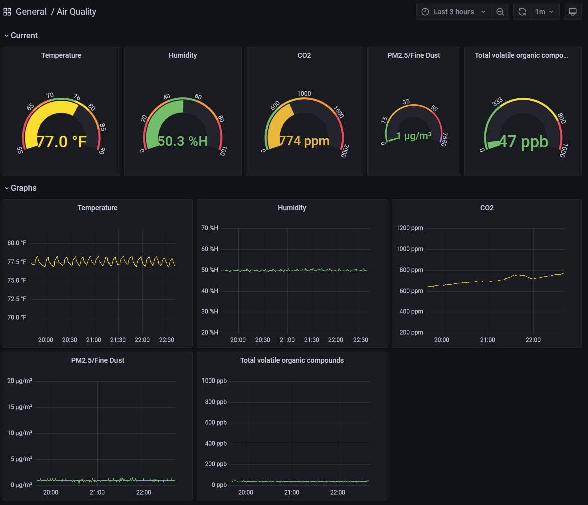

# Awair To TimescaleDB

This is an script that pulls data from an [Awair](https://getawair.com) device using their REST API, and inserts it into a [TimescaleDB](https://www.timescale.com/) database. I then use [Grafana](https://grafana.com/) to build dashboards that consume that data for my personal use.

## Getting Started
This isn't very user friendly, and you will likely not be able to get it going without some effort, but here are some general steps:
1. [Install TimescaleDB](https://docs.timescale.com/install/latest/self-hosted/).
2. Import the SQL schema from the included `schema.sql`.
3. Install [Python 3.10+](https://www.python.org/) (it probably works with lower, but I never tested) and [Poetry](https://python-poetry.org/docs/#installing-with-the-official-installer).
4. Copy/Rename `config.example.toml` to `config.toml` and fill out the fields. 
5. `poetry install` and `poetry run python main.py`

## Screenshots

## License
MIT
